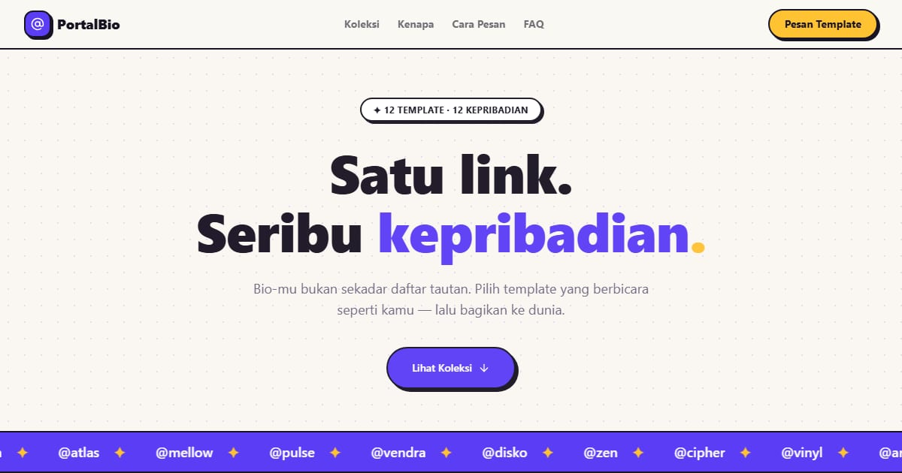

# PortalBio — Koleksi Template Link in Bio

PortalBio: 12 template link in bio dengan karakter unik — untuk kreator, musisi, bisnis, hingga developer.

**Demo live:** https://portal-bio-neon.vercel.app



> Katalog demo milik PintuWeb. Setiap kartu menautkan ke demo live yang bisa dicoba.

## Konsep

Katalog template link-in-bio. Neo-pop dengan font Unbounded, kartu berbingkai ponsel, dan marquee @handle.

## Varian yang dipamerkan (12)

- [Arsip Kata](https://linkinbio-arsip.vercel.app)
- [Atlas Studio](https://linkinbio-atlas.vercel.app)
- [cipher](https://linkinbio-cipher.vercel.app)
- [DISKO PANDA](https://linkinbio-disko.vercel.app)
- [Jajanan Bu Rina](https://linkinbio-jajan.vercel.app)
- [KASET KITA](https://linkinbio-kaset.vercel.app)
- [Mella](https://linkinbio-mellow.vercel.app)
- [Nova Ardhana](https://linkinbio-nova.vercel.app)
- [PULSE](https://linkinbio-pulse.vercel.app)
- [Kopi Vendra](https://linkinbio-vendra.vercel.app)
- [Laras](https://linkinbio-vinyl.vercel.app)
- [Sena](https://linkinbio-zen.vercel.app)

## Halaman

`/`

## Teknologi

- Next.js 15.5 (App Router) dan React 19
- Tailwind CSS v4
- JavaScript
- Framer Motion, Lucide (ikon)
- Font: Unbounded, Inter (next/font)
- SEO: metadata per halaman, Open Graph, JSON-LD, sitemap.xml, dan robots.txt

## Menjalankan secara lokal

```bash
npm install
npm run dev
```

Buka http://localhost:3000. Untuk build produksi: `npm run build` lalu `npm start`.

---

Dibuat oleh [PintuWeb](https://pintuweb.com), jasa pembuatan website.
